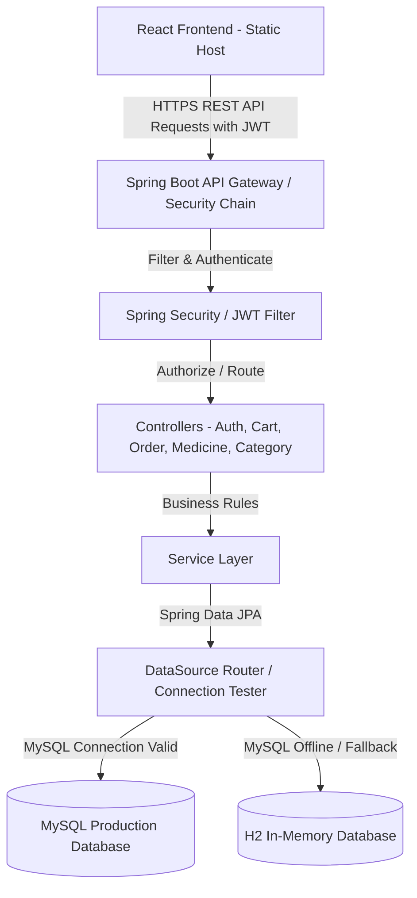

# 💊 Pharmacy Ordering System

A premium, production-ready, full-stack web application designed for seamless medicine purchasing, doctor prescription verification, and real-time inventory management. Built using a **Java Spring Boot** backend, **React.js + Vite** frontend, and **MySQL** database with a resilient auto-fallback mechanism.

---

## 🚀 Live Project & Deployments

*   **Frontend Web Application**: [https://pharmacy-frontend-iqtp.onrender.com](https://pharmacy-frontend-iqtp.onrender.com)
*   **Backend REST API Endpoint**: [https://pharmacy-backend-423r.onrender.com](https://pharmacy-backend-423r.onrender.com)
*   **Interactive API Documentation**: [https://pharmacy-backend-423r.onrender.com/swagger-ui.html](https://pharmacy-backend-423r.onrender.com/swagger-ui.html)
*   **GitHub Repository**: [https://github.com/Ridhi-215/pharmacy-ordering-system-project](https://github.com/Ridhi-215/pharmacy-ordering-system-project)

---

## 🛡️ Tech Stack & Badges


---

## 📄 Table of Contents
1. [Project Overview](#-project-overview)
2. [Key Features](#-key-features)
3. [System Architecture](#-system-architecture)
4. [Folder Structure](#-folder-structure)
5. [Screenshots](#-screenshots)
6. [Installation & Local Setup](#-installation--local-setup)
7. [Environment Variables](#-environment-variables)
8. [API Reference & Swagger Documentation](#-api-reference--swagger-documentation)
9. [Sample User Flow](#-sample-user-flow)
10. [Future Enhancements](#-future-enhancements)
11. [Author](#-author)

---

## 🌟 Project Overview

The **Pharmacy Ordering System** is a secure, end-to-end full-stack portal built to modernize medical retail. It provides a clean, responsive interface for customers to browse OTC and prescription-only medications, manage carts, upload doctor prescriptions, track orders, and collect loyalty rewards points. 

Simultaneously, the integrated admin portal gives pharmacists full oversight to manage catalog listings (CRUD), inspect and approve/reject customer prescription uploads, view real-time sales dashboards, and process orders.

### Resilient "Zero-Intervention" Fallback Design
For developers and recruiters testing deployments: if external MySQL parameters are omitted or become unreachable, the backend's custom `DataSource` dispatcher auto-detects the connection failure and dynamically spawns a localized, schema-seeded **H2 In-Memory Database** automatically. This prevents backend initialization crashes and guarantees a "one-click deploy" experience.

---

## ⚡ Key Features

### 👤 User Authentication & Role-Based Guards
*   Secured via Spring Security with high-precedence **JWT token authentication**.
*   Custom frontend React guards to prevent unauthorized routes (e.g. customer trying to access admin dashboards).
*   Dynamic navbar rendering depending on role and profile status.

### 💊 Catalog & Inventory Logic
*   **Search & Filtering**: Real-time filters by category, packaging type, price range, and search parameters.
*   **Inventory Enforcement**: Automatic reduction of items stock quantity when orders are placed, with validation prevention if stock drops below user-requested counts.
*   **Prescription Policy**: Medicines marked with `requires_prescription = true` cannot be purchased unless the user has uploaded a medical prescription file that an Admin has marked **APPROVED**.

### 💼 Loyalty Points & Cart
*   Dynamic cart management with persistence.
*   Earn loyalty points for placing orders, redeemable for discounts on checkout.

### 📊 Admin Portal Analytics
*   Dashboard reporting total sales, orders processed, low-stock warnings, and pending prescriptions.
*   Category creation and medicine inventory management panels.
*   Prescription management approval workflow.

---

## 🏗️ System Architecture

The following diagram illustrates the flow of requests from the client frontend application to the API backend, highlighting our database fallback and pre-flight CORS layers:



---

## 📁 Folder Structure

The project has a modular, well-documented directory hierarchy:

```text
pharmacy-ordering-system/
├── database/
│   ├── schema.sql             # MySQL ER database structure schema
│   └── seed.sql               # Pre-populated admin, customers, categories, and points
├── backend/
│   ├── pom.xml                # Maven project metadata and dependency configurations
│   ├── Dockerfile             # Production multi-stage Java build script
│   └── src/main/java/com/pharmacy/ordering/
│       ├── config/            # Static paths configuration, dynamic datasource and CORS config
│       ├── controller/        # REST controllers handling API endpoints
│       ├── dto/               # Unified data structures for Request/Response mapping
│       ├── entity/            # JPA Data models representing relational tables
│       ├── exception/         # Custom exception classes and global error handles
│       ├── repository/        # JPA Repository interfaces for data queries
│       ├── security/          # Spring Security, Password encoders, and JWT filters
│       └── service/           # Transactional business services
└── frontend/
    ├── package.json           # React dependencies and scripts
    ├── vite.config.js         # Vite configuration settings
    ├── .env.production        # Environment files containing backend API endpoints
    └── src/
        ├── components/        # Reusable navbar, footers, and card designs
        ├── context/           # React AuthContext APIs for user state
        ├── pages/             # Layout pages (Login, Register, Medicines Catalog, Carts, Checkout)
        ├── routes/            # Dynamic route restrictions based on roles
        └── services/          # API configurations using Axios interceptors
```

---

## 📸 Screenshots

<!-- Screenshot 1: User Login Screen -->
<!-- Place user login interface screenshot here -->

<!-- Screenshot 2: Medicine Catalog Shop -->
<!-- Place shop interface screenshot here -->

<!-- Screenshot 3: Cart and Checkout Details -->
<!-- Place cart details and checkouts here -->

<!-- Screenshot 4: Admin Dashboard Metrics -->
<!-- Place admin metric statistics here -->

---

## 🔧 Installation & Local Setup

### Prerequisites
*   **Java SDK 17**
*   **Node.js v18+ & npm**
*   **Maven**
*   **MySQL Server 8.x** (Optional - if omitted, it defaults to H2 DB)

### Step 1: Database Initialization (Optional)
If using a local MySQL server:
1. Log in to your MySQL terminal and run:
   ```sql
   CREATE DATABASE pharmacy_db;
   ```
2. Import the schema and seed files to set up standard tables and mock items:
   ```bash
   mysql -u root -p pharmacy_db < database/schema.sql
   mysql -u root -p pharmacy_db < database/seed.sql
   ```

### Step 2: Backend Configuration & Start
1. Go to the `backend` folder:
   ```bash
   cd backend
   ```
2. Update the JDBC configurations in `src/main/resources/application.properties` with your credentials:
   ```properties
   spring.datasource.url=jdbc:mysql://localhost:3306/pharmacy_db?useSSL=false&serverTimezone=UTC
   spring.datasource.username=YOUR_MYSQL_USERNAME
   spring.datasource.password=YOUR_MYSQL_PASSWORD
   ```
   *(If you leave these fields empty or incorrect, the backend automatically seeds and spins up an in-memory H2 database instead).*
3. Compile and launch the Spring Boot server:
   ```bash
   mvn clean package -DskipTests
   mvn spring-boot:run
   ```
4. The server runs at `http://localhost:8080`. Interactive API Docs are accessible at `http://localhost:8080/swagger-ui/index.html`.

### Step 3: Frontend Installation & Start
1. Open a new terminal and navigate to the `frontend` folder:
   ```bash
   cd frontend
   ```
2. Install the node packages:
   ```bash
   npm install
   ```
3. Start the local Vite development server:
   ```bash
   npm run dev
   ```
4. Open your browser and navigate to the local port: `http://localhost:5173`.

---

## 🔑 Environment Variables

The project uses modular environment values to configure security parameters and cross-service endpoints:

### Backend Variables
| Variable Name | Purpose | Example Value |
| :--- | :--- | :--- |
| `PORT` | Local port the Spring server listens to. | `8080` |
| `DB_URL` | MySQL Connection URL. Defaults to H2 fallback if empty. | `jdbc:mysql://host:port/dbname` |
| `DB_USERNAME` | Production database username. | `db_user` |
| `DB_PASSWORD` | Production database connection secret. | `db_password` |
| `JWT_SECRET` | 256-bit cryptographically secure string for JWT generation. | `your_secret_key_here` |
| `FRONTEND_URL` | Configured CORS Allowed Origins. | `https://pharmacy-frontend-iqtp.onrender.com` |

### Frontend Variables
| Variable Name | Purpose | Example Value |
| :--- | :--- | :--- |
| `VITE_API_URL` | Target backend REST endpoint for client Axios requests. | `https://pharmacy-backend-423r.onrender.com` |

---

## 📖 API Reference & Swagger Documentation

The Spring Boot backend exposes a complete OpenAPI-compliant API. You can read, interact with, and execute backend endpoint methods through the Swagger UI:

🔗 **Swagger UI Interactive Console**: [https://pharmacy-backend-423r.onrender.com/swagger-ui.html](https://pharmacy-backend-423r.onrender.com/swagger-ui.html)

### Key Endpoints Snapshot
*   **Authentication**:
    *   `POST /api/auth/register` - Create user profile.
    *   `POST /api/auth/login` - Sign in and receive JWT token.
    *   `GET /api/auth/profile` - Fetch details of the authenticated profile.
*   **Medicines**:
    *   `GET /api/medicines` - List all medicines (with pagination & category filters).
    *   `POST /api/medicines` - Add new item to catalog *(Admin only)*.
    *   `PUT /api/medicines/{id}` - Modify details, pricing, or stock *(Admin only)*.
*   **Prescriptions**:
    *   `POST /api/prescriptions/upload` - Customer uploads medical prescription.
    *   `PUT /api/prescriptions/{id}/approve` - Set status to APPROVED *(Admin only)*.

---

## 👥 Sample User Flow

To test the end-to-end integration instantly without manual user signups, use the pre-configured credentials below:

### 1. Customer User Flow
*   **Sign-In Info**: Email: `customer@pharmacy.com` | Password: `customer123`
*   **Checkout OTC Drug**: Add non-prescription items (e.g. Paracetamol) to the cart and proceed to checkout.
*   **Checkout Restricted Drug**: Add prescription items (e.g. Insulin). Try checking out. The transaction will block, alerting you to upload a doctor prescription first. Navigate to the upload menu, select a doctor note, and submit it.
*   **Points Redemption**: Enter loyalty points on checkout to lower the payment amount.

### 2. Administrator Flow
*   **Sign-In Info**: Email: `admin@pharmacy.com` | Password: `admin123`
*   **Prescription Verification**: View list of submitted prescriptions, view documents, and click approve. Go back to the customer account to complete the restricted checkout.
*   **Inventory Auditing**: Create, edit, and delete medicines, or view the core analytics charts showing sales metrics.

---

## 🔮 Future Enhancements
*   [ ] **Real-time Email Notifications**: Automating order receipt and prescription status email notifications via SMTP.
*   [ ] **Payment Gateway Integration**: Integration of Stripe API to securely process real credit card payments.
*   [ ] **Real-time Chat**: Implement WebSocket support for real-time customer support chat.

---

## 👤 Author

*   **Ridhi**
    *   GitHub: [@Ridhi-215](https://github.com/Ridhi-215)

---
*Developed with dedication for high-performance healthcare management.*
